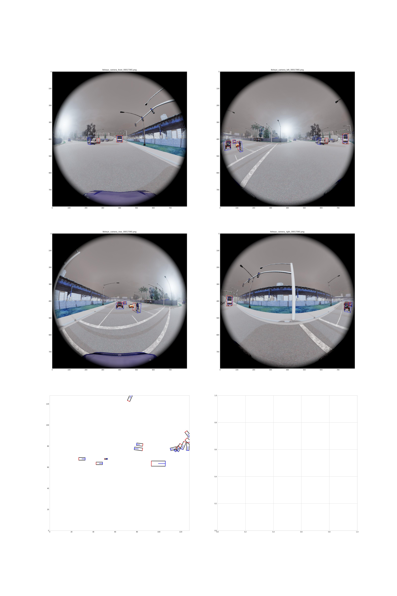
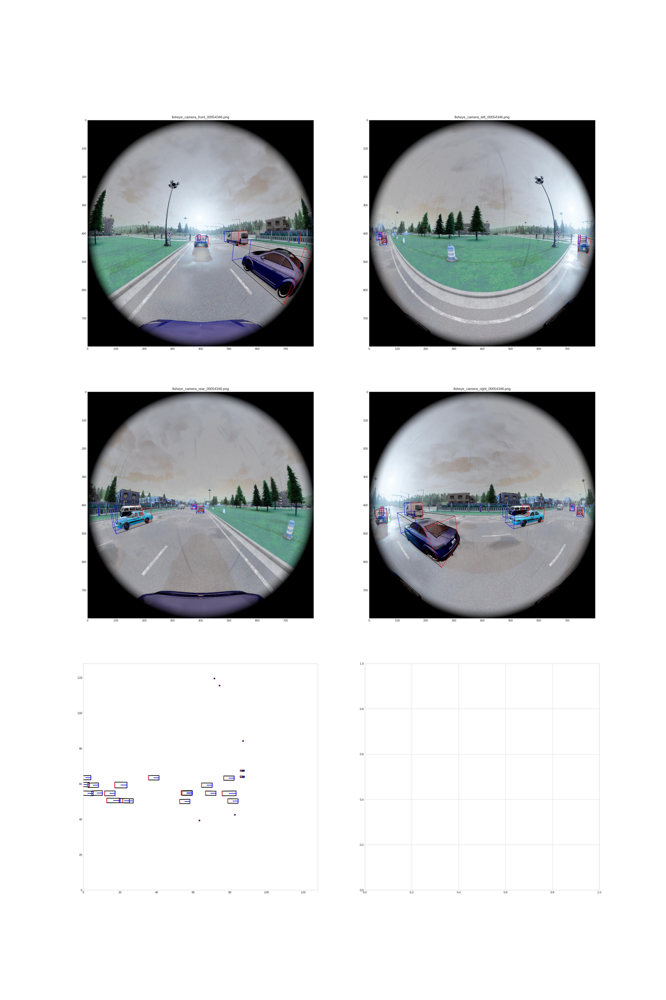

# DeployMatBEV

A self-learned matrix view transformer for **NPU-deployable** multi-fisheye BEV 3D object detection.

> 🔗 [中文文档](README_CN.md)

> PDF [DeployMatBEV PDF](paper_outputs/paper_main.pdf)
---

## Overview

Surround-view fisheye cameras provide low-cost 360° perception for autonomous driving and automated parking. However, state-of-the-art BEV detectors rely on operators such as `grid_sample`, 2D `gather`, `scatterND`, and one-hot construction — whose **irregular, data-dependent memory access patterns** are fundamentally mismatched with embedded NPU architectures.

**DeployMatBEV** replaces the entire explicit geometry-driven view transformation with **learnable separable matrix projections**. The core data path consists solely of:
- Matrix multiplication (`matmul`)
- Tensor permutation
- Channel-wise softmax
- Element-wise multiplication & addition

All operators exhibit **regular, contiguous memory access** — the kind of operations that NPUs are built to accelerate at full MAC throughput.

---

## 🔥 Highlights

| Feature | DeployMatBEV | Fisheye3DOD (baseline) |
|:--------|:------------:|:----------------------:|
| **NDS** | **0.4801** | 0.4853 |
| **mASE** | **0.1319** | 0.1637 |
| **mAOE** | **0.3826** | 0.4799 |
| `grid_sample` | ❌ None | ✅ Used |
| 2D `gather` | ❌ None | ✅ Used |
| `scatterND` / BEVPool | ❌ None | ✅ Used |
| Camera extrinsics at inference | ❌ Not needed | ✅ Required |
| Total parameters | **14.5M** (v3) | 19.5M |
| Quantization friendly | ✅ PTQ / QAT | Partial |

- **0.0052 NDS gap** to the geometry-based baseline — with **25.8% fewer parameters**.
- **No camera extrinsics** (`lidar2camera`, `ego2camera`) needed at inference time.
- Three capacity variants (`learning_point_version = 1/2/3`) with the same NPU-friendly operator set.
- Preliminary validation on **nuScenes pinhole** (6 cameras) confirms the operator set transfers across camera models.

---

## 🏗️ Architecture

```
4× Fisheye Images (800×800)
        ↓
   EfficientNet-B0 Image Encoder
        ↓
  FastSCNN-style Feature Neck (64ch)
        ↓        ↓
   Image Branch    Depth-Gating Branch (1×1 conv + channel-wise softmax)
        ↓                  ↓
   Self-Learned Separable Matrix Projection (H×W → H_b×W_b)
        ↓                  ↓
     B_i^F  ⊙  B_i^D   (element-wise fusion)
        ↓
   Sum over 4 views → Unified BEV (128×128)
        ↓
   BEV Encoder + Center-based Decoder
        ↓
   3D Boxes [x, y, z, w, l, h, yaw]
```

The key operator is `_spatial_transfom_learn` in [`model/view_transformerFisheye.py`](model/view_transformerFisheye.py), which learns view-specific projection matrices along the height and width dimensions — no reference points, no BEV grids, no sampling.

---

## 🗂️ Model Zoo

### Fisheye3DOD (4 surround-view fisheye cameras)

Fisheye3DOD pretrained models download link: [https://www.alipan.com/s/HKq1YjCYVjj 提取码: 78yp](https://www.alipan.com/s/HKq1YjCYVjj)

| Version | `learning_point_version` | Checkpoint | NDS | mAP | mATE | mASE | mAOE | Params |
|:-------:|:------------------------:|:-----------|:---:|:---:|:----:|:----:|:----:|:------:|
| v1 | `1` | [`float-checkpoint-best1.pth.tar`](https://www.alipan.com/s/HKq1YjCYVjj) | 0.4361 | 0.3047 | 0.7160 | 0.1324 | 0.4489 | 12.8M |
| v2 | `2` | [`float-checkpoint-best.pth2.tar`](https://www.alipan.com/s/HKq1YjCYVjj) | 0.4392 | 0.3132 | 0.7202 | 0.1399 | 0.4448 | 13.4M |
| v3 | `3` | [`float-checkpoint-best3.pth.tar`](https://www.alipan.com/s/HKq1YjCYVjj) | 0.4766 | 0.3533 | 0.6478 | **0.1319** | 0.4209 | 14.5M |
| v3* | `3` | [`float-checkpoint-best333.pth.tar`](https://www.alipan.com/s/HKq1YjCYVjj) | **0.4801** | 0.3515 | 0.6578 | 0.1333 | **0.3826** | 14.5M |

> **v3*** denotes an extended training run with improved orientation estimation.

### Baseline

| Method | Checkpoint | NDS | mAP | Params |
|:-------|:-----------|:---:|:---:|:------:|
| Fisheye3DOD | [`fisheye_bevdet.pth`](model/ckpt/fisheye_bevdet.pth) | 0.4853 | 0.3821 | 19.5M |

> The original Fisheye3DOD uses a ResNet-18 + FPN image backbone, a SECOND BEV backbone, and additionally stores **1.44M non-learnable geometry buffers** (frustum & sphere grids).

### nuScenes (6 pinhole cameras, preliminary)

| Variant | `learning_point_version` | NDS | mAP |
|:--------|:------------------------:|:---:|:---:|
| Extended v9 | `9` | 0.1717 | 0.0599 |
| Extended v10 | `10` | 0.1895 | 0.0788 |
| Extended v11 | `11` | **0.1903** | **0.0773** |

> These are early-stage checkpoints reported only as a **generality check** across camera models. Not competitive with SOTA nuScenes detectors.

---

## 🛠️ Environment

We use the Horizon OpenExplorer Docker container for training and evaluation.

**Docker image**: `docker_open_explorer_ubuntu_22_j6_gpu_v3.8.1`

Download: [https://oe.horizon.auto/download/oe](https://oe.horizon.auto/download/oe)


---

## 📦 Data Preparation

### Fisheye3DOD

Dataset source: [https://github.com/weiyangdaren/Fisheye3DOD](https://github.com/weiyangdaren/Fisheye3DOD)

**Step 1**: Generate info pickles (same as the official repo):

```bash
python3 projects/Fisheye3DOD/tools/fisheye3dod_converter.py
```

**Step 2**: Pack into LMDB format for efficient loading:

```bash
python3 lmdbdata/fisheye_carla_packer.py \
  --src-data-dir ./Fisheye3DODdataset \
  --meta_json_dir ./ImageSets-2hz \
  --pack-type lmdb \
  --target-data-dir ./lmdb \
  --split-name train \
  --num-workers 10

python3 lmdbdata/fisheye_carla_packer.py \
  --src-data-dir ./Fisheye3DODdataset \
  --meta_json_dir ./ImageSets-2hz \
  --pack-type lmdb \
  --target-data-dir ./lmdb \
  --split-name val \
  --num-workers 10
```

**Step 3**: Visualize LMDB data for inspection

```bash
python3 imageCheck.py --config ./config/bev_lss_efficientnetb0_multitask_nuscenes.py --savePath ./output
```

### nuScenes

Dataset source: [https://github.com/nutonomy/nuscenes-devkit](https://github.com/nutonomy/nuscenes-devkit)

```bash
python3 lmdbdata/nuscenes_packer.py \
  --src-data-dir ./nuscenes \
  --version ./v1.0-trainval \
  --pack-type lmdb \
  --target-data-dir ./nuscenes_lmdb \
  --split-name train \
  --num-workers 10

python3 lmdbdata/nuscenes_packer.py \
  --src-data-dir ./nuscenes \
  --version ./v1.0-trainval \
  --pack-type lmdb \
  --target-data-dir ./nuscenes_lmdb \
  --split-name val \
  --num-workers 10
```

> Use `v1.0-mini` for exploration only, not for training.

---

## 🚀 Training

### Single GPU

```bash
# Fisheye3DOD
python3 train.py --stage float \
  --config ./config/bev_lss_efficientnetb0_multitask_nuscenes.py \
  --device-ids 0

# nuScenes
python3 train.py --stage float \
  --config ./config/nuscene_config.py \
  --device-ids 0
```

### Multi GPU

```bash
python3 train.py --stage float \
  --config ./config/bev_lss_efficientnetb0_multitask_nuscenes.py \
  --device-ids 0,1
```

### Key Hyperparameters

| Parameter | Value |
|:----------|:-----:|
| Input resolution | 800 × 800 |
| Image feature size | 50 × 50 (16× downsample) |
| BEV grid | 128 × 128 |
| BEV range | 51.2 m × 51.2 m (@ 0.4 m/cell) |
| Feature channels | 64 |
| Depth channels | 64 |
| Hidden projection dim R | 256 |
| Optimizer | AdamW (lr=2e-4, weight_decay=0.01) |
| Schedule | Cyclic LR |
| Epochs | 36 (float) |
| GPUs | 4 |
| Batch per GPU | 1 (effective batch = 4) |

> Capacity is controlled by `learning_point_version` in the config file: `1` (direct projection), `2` (one hidden layer, default), `3` (two hidden layers).

---

## 📊 Evaluation

### Fisheye3DOD

```bash
# Version 3 (best NDS)
python3 predict.py --stage float \
  --config ./config/bev_lss_efficientnetb0_multitask_nuscenes.py \
  --device-ids 0 \
  --learning_point_version 3 \
  --ckpt ./model/ckpt/float-checkpoint-best3.pth.tar

# Version 3* (extended training)
python3 predict.py --stage float \
  --config ./config/bev_lss_efficientnetb0_multitask_nuscenes.py \
  --device-ids 0 \
  --learning_point_version 3 \
  --ckpt ./model/ckpt/float-checkpoint-best333.pth.tar

# Version 2
python3 predict.py --stage float \
  --config ./config/bev_lss_efficientnetb0_multitask_nuscenes.py \
  --device-ids 0 \
  --learning_point_version 2 \
  --ckpt ./model/ckpt/float-checkpoint-best.pth2.tar

# Version 1
python3 predict.py --stage float \
  --config ./config/bev_lss_efficientnetb0_multitask_nuscenes.py \
  --device-ids 0 \
  --learning_point_version 1 \
  --ckpt ./model/ckpt/float-checkpoint-best1.pth.tar
```

### nuScenes

nuScenes pretrained models download link: [https://www.alipan.com/s/kAsevEPwv51 提取码: e81v](https://www.alipan.com/s/kAsevEPwv51)

```bash
python3 predict.py --stage float \
  --config ./config/nuscene_config.py \
  --device-ids 0 \
  --learning_point_version 11 \
  --ckpt ./model/ckptnuscene/float-checkpoint-best.pth111111.tar
```

---

## 🎨 Visualization

Fisheye3DOD
```bash
# Version 3 (best NDS)
python3 infer_float.py \
  --config ./config/bev_lss_efficientnetb0_multitask_nuscenes.py \
  --save-path ./infer_out \
  --model-inputs ./demo/fisheye3dod_demo/16 \
  --learning_point_version 3 \
  --ckpt ./model/ckpt/float-checkpoint-best3.pth.tar

# Version 3* (extended training)
python3 infer_float.py \
  --config ./config/bev_lss_efficientnetb0_multitask_nuscenes.py \
  --save-path ./infer_out \
  --model-inputs ./demo/fisheye3dod_demo/16 \
  --learning_point_version 3 \
  --ckpt ./model/ckpt/float-checkpoint-best333.pth.tar

# Version 2
python3 infer_float.py \
  --config ./config/bev_lss_efficientnetb0_multitask_nuscenes.py \
  --save-path ./infer_out \
  --model-inputs ./demo/fisheye3dod_demo/16 \
  --learning_point_version 2 \
  --ckpt ./model/ckpt/float-checkpoint-best.pth2.tar
```

nuScenes
```bash
python3 infer_float.py --config ./config/nuscene_config.py \
--save-path ./infer_out --model-inputs ./demo/bev_lss_efficientnetb0_multitask_nuscenes \
--learning_point_version 10 --ckpt ./model/ckptnuscene/float-checkpoint-best.pth101010.tar


python3 infer_float.py --config ./config/nuscene_config.py \
--save-path ./infer_out --model-inputs ./demo/bev_lss_efficientnetb0_multitask_nuscenes \
--learning_point_version 9 --ckpt ./model/ckptnuscene/float-checkpoint-best.pth99.tar

python3 infer_float.py --config ./config/nuscene_config.py \
--save-path ./infer_out --model-inputs ./demo/bev_lss_efficientnetb0_multitask_nuscenes \
--learning_point_version 11 --ckpt ./model/ckptnuscene/float-checkpoint-best.pth111111.tar
```

Output example:




---

## 📤 ONNX Export

Fisheye3DOD
```bash
python3 export_onnx.py \
  --config ./config/bev_lss_efficientnetb0_multitask_nuscenes.py \
  --learning_point_version 3 \
  --ckpt ./model/ckpt/float-checkpoint-best3.pth.tar
```

nuScenes
```bash
python3 export_onnx.py --config ./config/nuscene_config.py \
--learning_point_version 10 --ckpt ./model/ckptnuscene/float-checkpoint-best.pth101010.tar
```
---

## 📐 Parameter Statistics

Run the parameter counting script:

```bash
python3 model/statistic.py
```

| Model | VT Params (learnable) | Total Params | Checkpoint Size |
|:------|:---------------------:|:------------:|:---------------:|
| Original Fisheye3DOD | 0.05M + 1.44M buffers | 19.48M | 235.4 MB |
| DeployMatBEV v1 | 0.10M | 12.79M | 82.1 MB |
| DeployMatBEV v2 | 0.73M | 13.41M | 89.6 MB |
| DeployMatBEV v3 | 1.78M | 14.46M | 102.2 MB |

> Checkpoint files include optimizer state; pure model weights are roughly half the size.

## Reference

- [Fisheye3DOD](https://github.com/weiyangdaren/Fisheye3DOD)
- [horizon PTQ/QAT deployment guide](https://doc.oe.horizon.auto/3.8.1/guide/model_compile.html)
- [horizon developer portal](https://developer.horizon.auto/)
- [ocamcalib_undistort](https://github.com/matsuren/ocamcalib_undistort)
- [mmdetection3d](https://github.com/open-mmlab/mmdetection3d)
- [lift-splat-shoot](https://github.com/nv-tlabs/lift-splat-shoot)
- [nuscenes-devkit](https://github.com/nutonomy/nuscenes-devkit)
- [Trae](https://www.trae.cn/)

---

## 📝 Citation

If you find this work useful, please cite:

```bibtex
@article{zou2025deploymatbev,
  title={DeployMatBEV: A Self-Learned Matrix View Transformer for NPU-Deployable Multi-Fisheye BEV 3D Object Detection},
  author={Zou, Jiu},
  journal={github repository},
  year={2026}
}
```

---

## 📄 License

This project is released under the GPL-3.0 license.

---

**Contact**: Jiu Zou — [1069679911@qq.com](mailto:1069679911@qq.com)

Goyu Meta Technology Co., Ltd.

---

## 📎 Appendix: Design Rationale of `learning_point_version` from myself

All variants share the same core idea: replace explicit geometric projection with **learnable separable matrices** applied along the image height (H) and width (W) axes. The differences lie in projection depth, channel splitting, normalization, and whether the depth branch is active. Code reference: [`_spatial_transfom_learn`](model/view_transformerFisheye.py#L1605-L2018).

### Fisheye3DOD variants (v1 / v2 / v3)

| | v1 | v2 | v3 |
|:--|:--|:--|:--|
| Matmuls per axis | 1 | 2 | 3 |
| Hidden projection layers | 0 | 1 | 2 |
| Depth branch | ✅ Active | ✅ Active | ✅ Active |
| Fusion | `img_BEV × depth_BEV` (element-wise) | same | same |
| View aggregation | Sum over views | same | same |

**Design logic:**
- **v1** — Minimal form. One matmul per axis: `W_img(50→128)` then `H_img(50→128)` after a permute. Proves that pure learned matrices alone can perform view transformation.
- **v2** — Adds one hidden layer per axis (e.g. `50→256→128`), increasing the expressiveness of the learned mapping while keeping the operator set unchanged.
- **v3** — Two hidden layers per axis (`50→256→256→128`). Deepest variant; best accuracy (NDS 0.4766–0.4801). The per-axis factorization keeps compute far below a dense `(H·W)→(H_b·W_b)` projection.
- All three use a **dual-branch design**: image features and depth-gating features are projected by independent matrix sets (`param_point*` / `dparam_point*`), then fused element-wise. Depth supervision is injected through the depth branch, which acts as a soft occlusion/visibility gate.

### nuScenes variants (v9 / v10 / v11)

| | v9 | v10 | v11 |
|:--|:--|:--|:--|
| Base structure | v3-style, 3 layers/axis | v3-style, 3 layers/axis | v10 + final output projection |
| Channel processing | Split into 3 × 64ch chunks, projected separately | Full channels | Full channels |
| Normalization | BatchNorm between matmuls | BatchNorm between matmuls | BatchNorm between matmuls |
| Residual links | ✅ (input of each axis stage added back) | ✅ | ✅ |
| Depth branch | ❌ Disabled (image-only) | ❌ Disabled | ❌ Disabled |
| Merge | Per-chunk concat → BN → concat views → BN | Concat views → BN | Concat views → BN |

**Design logic:**
- **v9** ("SplitMatrix") — Splits 192 channels into three 64-channel groups, each with its own projection matrices, then merges. Motivation: let different channel groups specialize in different spatial mappings (group-wise projection), at the cost of more parameters.
- **v10** — Full-channel v3-style projection with **BatchNorm + residual connections** inserted between chained matmuls. This breaks the linear collapse of pure matmul chains and stabilizes training on the larger nuScenes dataset. Depth branch disabled to reduce memory for 6-camera batches.
- **v11** — v10 plus an extra final projection matrix after the second-axis stage, giving the network one more learnable remapping step before BEV output. Slightly better NDS/mAP than v10.

### Potential Improvements from trae Kimi-K3

1. **Non-linearity in v1–v3.** Pure chained matmuls without non-linearities are mathematically collapsible into a single matrix. Adding BN/ReLU (as done in v9–v11) or low-rank bottlenecks would give v3 genuine depth advantage instead of only optimization-dynamics benefits.
2. **Re-enable depth gating in v9–v11.** The depth branch is currently commented out; restoring the `img × depth` gating used in v1–v3 may recover the orientation/scale benefits seen on Fisheye3DOD.
3. **Weight sharing across views.** Each view currently owns independent matrices. Sharing (or partially sharing, e.g. low-rank + per-view residual) would cut parameters and improve generalization when camera rigs are symmetric.
4. **Batched view processing.** The per-view Python loop can be replaced by a single batched matmul (`bmm`) or block-diagonal formulation, improving GPU/NPU utilization.
5. **Initialization from geometry.** Initializing learned matrices from the known camera geometry (e.g. bilinear sampling weights) instead of random init may speed convergence and close the remaining NDS gap to the geometric baseline.
6. **Quantization-aware depth of projection.** `bev_quant`/`depth_bev_quant` QAT hooks already exist at the fusion point; extending QAT across the full projection chain would validate INT8 accuracy drop on real NPU hardware.
7. **Distillation from geometric teacher.** Using the explicit-geometry baseline as a teacher for the learned matrices is a low-cost way to combine geometric inductive bias with NPU-friendly operators.
